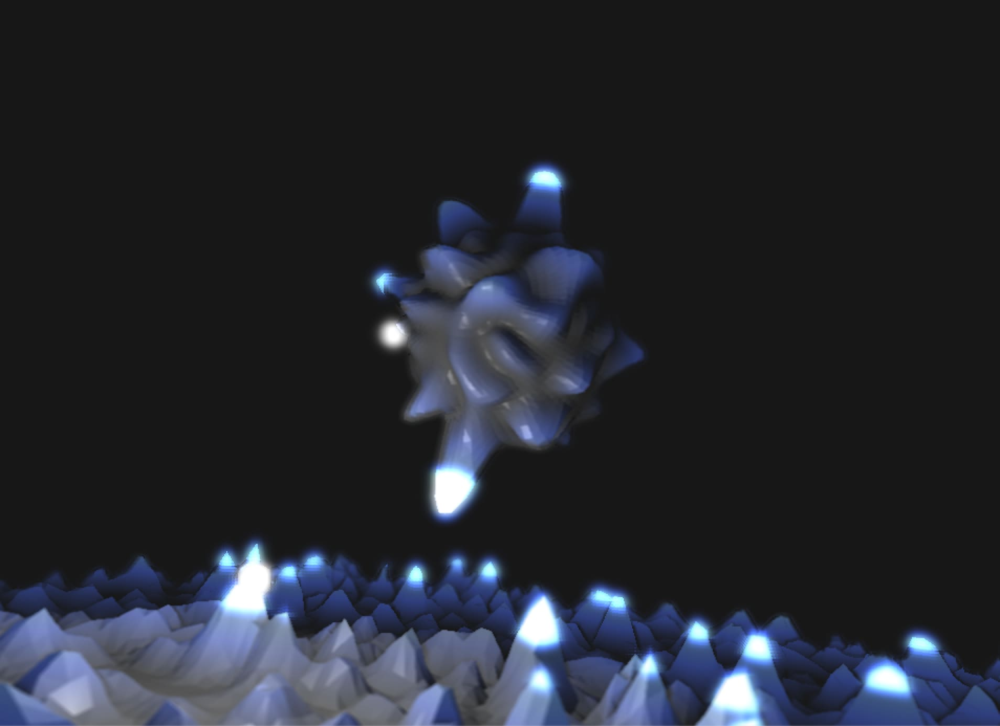
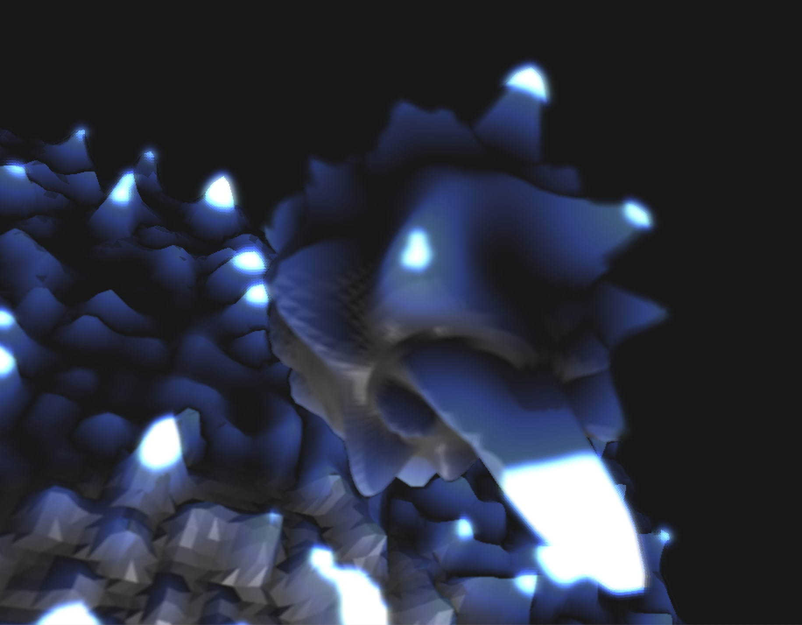
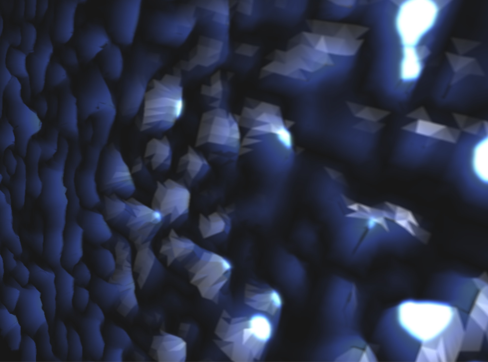

## Emitter Sphere
data: 20170830

### Addon
* ofxDeferredShading
* ofxGui

### Capture

### Referrence
* [Kezzerdrix's source code in IAMAS WS](https://github.com/kezzardrix/iamas_workshop/tree/master/GeomtryShaderSubdivision)
