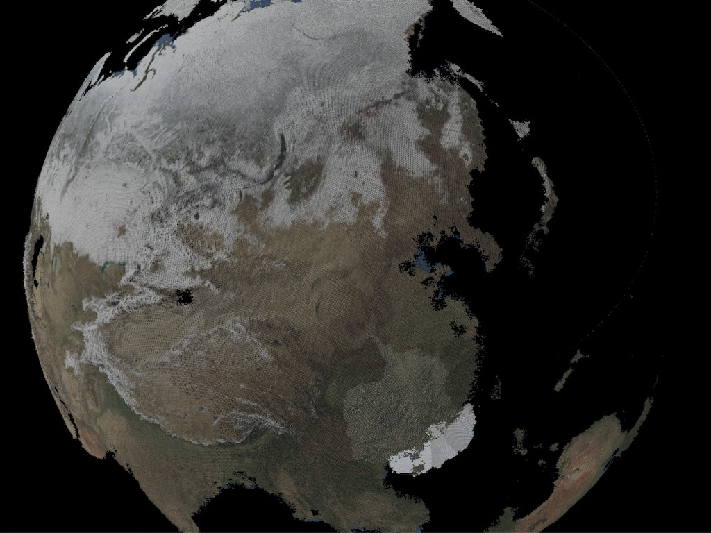

## Mesh Earth
date: 20170814

### Capture

### Data Source
* [Topographic map](https://lta.cr.usgs.gov/GMTED2010)
    * fetch command is [here](https://code.earthengine.google.com/d905bfffd39fa362ad6d23f315214df2).
* [Coast line(Batymetry)](https://visibleearth.nasa.gov/view.php?id=73963)
* [Color image](https://visibleearth.nasa.gov/view.php?id=73909)
