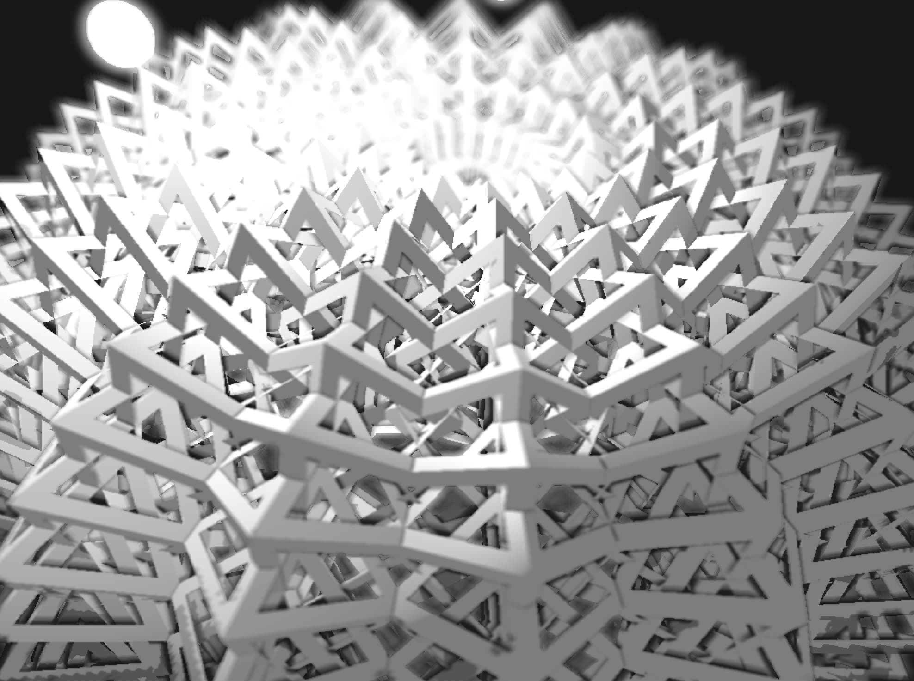
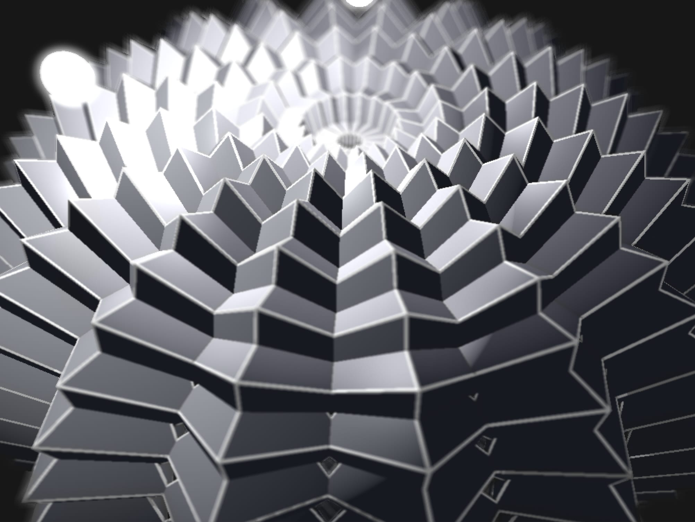
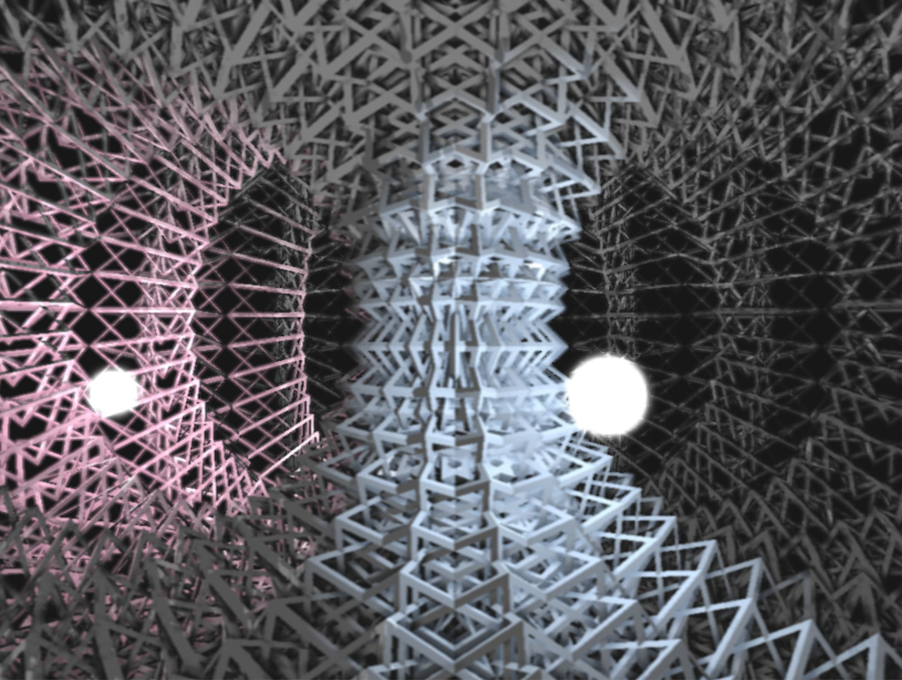

## Wireframe Shader
date: 20170915

### Addon
* ofxDeferredShading
* ofxGui

### Capture

### Reference
* [Easy wireframe display with barycentric coordinates](http://codeflow.org/entries/2012/aug/02/easy-wireframe-display-with-barycentric-coordinates/)
